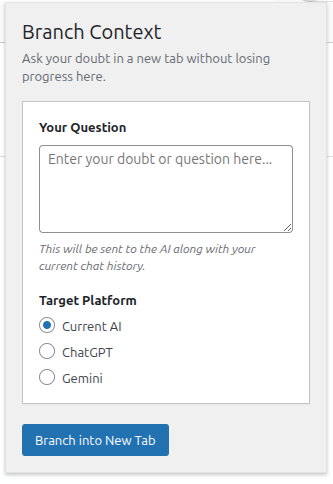

# SideQuest

SideQuest is a simple Chrome extension that lets you ask side questions while using ChatGPT or Gemini without losing your place. 

If you're deep in a conversation and get a random doubt, you can click the extension to branch off into a new tab. It automatically carries over your current chat history and asks your new question there, keeping your original chat clean and focused.

## How to install
1. Download or clone this repository.
2. Go to `chrome://extensions/` in Chrome.
3. Turn on **Developer mode** in the top right.
4. Click **Load unpacked** and select the folder containing these files.
